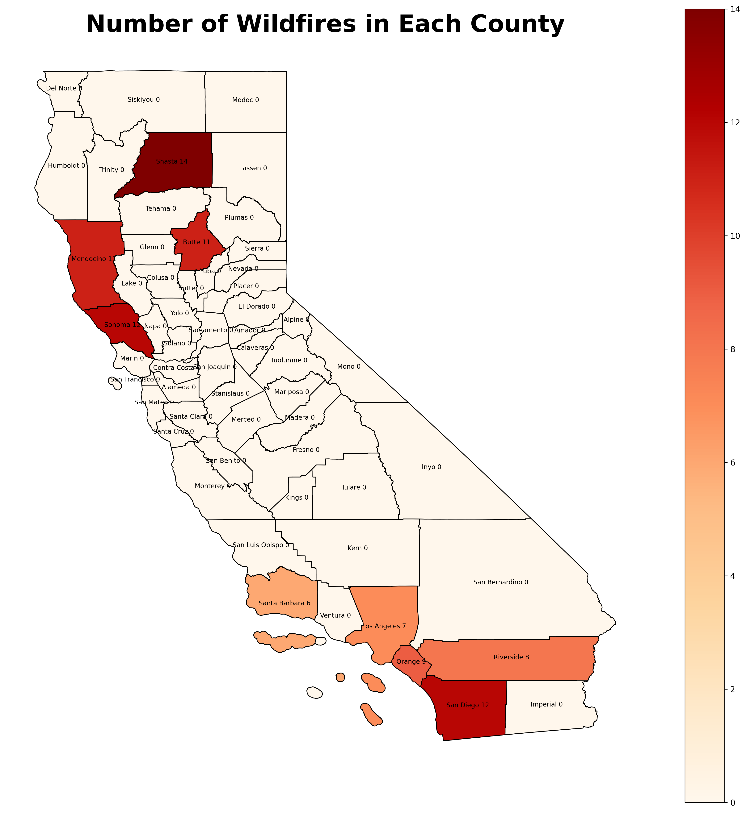

# 🔥 California Wildfire Damage (2014–2024)

This project explores wildfire patterns in California using EDA, clustering, and geospatial visualization.

* Number of Wildfires occurrences across California. *
**Introduction**
California experiences frequent wildfires due to its dry climate and vegetation conditions. These wildfires can cause devastating impacts on communities, infrastructure, and the economy.

This project explores wildfire patterns between 2014–2024 using data on acres burned, homes destroyed, injuries, fatalities, and financial loss. Through exploratory data analysis (EDA), clustering, and geospatial visualization, we aim to uncover:

- Which counties experience the most wildfires

- The leading causes of fires with the greatest damages

- Patterns of financial loss and property destruction

- Clustering of counties based on severity of fire impact