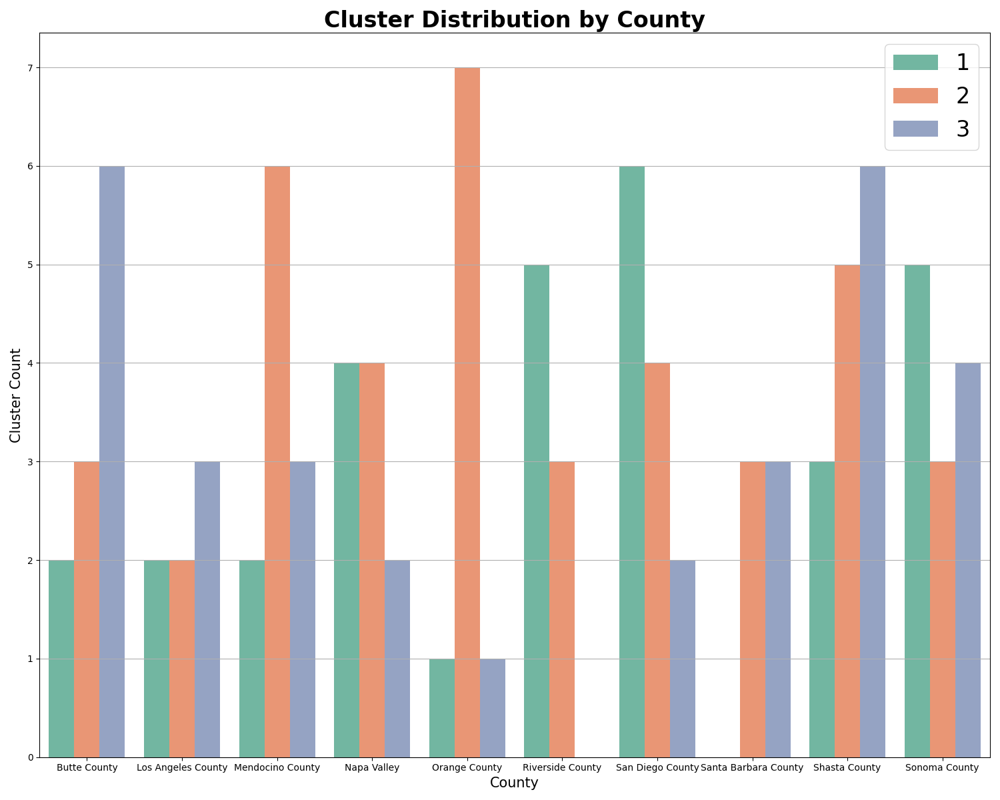

# 🔥 California Wildfire Damage (2014–2024)

This project explores wildfire patterns in California using EDA, clustering, and geospatial visualization.


* Number of Wildfires occurrences across California.

📌 Project Overview

California experiences frequent wildfires due to its dry climate and vegetation conditions. These wildfires can cause devastating impacts on communities, infrastructure, and the economy.

This project explores wildfire patterns between 2014–2024 using data on acres burned, homes destroyed, injuries, fatalities, and financial loss. Through exploratory data analysis (EDA), clustering, and geospatial visualization, we aim to uncover:

- Which counties experience the most wildfires

- The leading causes of fires with the greatest damages

- Patterns of financial loss and property destruction

- Clustering of counties based on severity of fire impact

📂 Data Sources

1. California Wildfire Damage Dataset (2014-2024)
- Variables: Incident_ID, Date, Location, Area_Burned (Acres), Homes_Destroyed, Businesses_Destroyed, Vehicles_Damaged, Injuries, Fatalities, Estimated_Financial_Loss (Million $), Cause
2. California County Shapefile (CA_Counties.shp)
- Used for geospatial visualizations

⚙️ Methodology

1.Exploratory Data Analysis (EDA)

- Summary statistics, histograms, and boxplots

- Correlation heatmaps to identify relationships between variables

- Yearly trends of wildfires and damages

2. Geospatial Visualization

- Choropleth maps showing wildfire frequency and severity by county

3. Clustering (K-Means)

- Features: Area Burned, Homes Destroyed, Businesses Destroyed, Vehicles Damaged, Injuries, Fatalities, Financial Loss

- Clusters the fires into different categories based on what types of damage the wildfires cause the most

🗂️ Code Structure
```
California-Wildfires-EDA-Project/
│
├── data/                 
│   └── California_Wildfire_Damage.csv
│   └── CA_Counties.shp
│
├── notebooks/           
│   └── exploration.ipynb
│
│
├── outputs/               # Figures and reports
│   └── figures/
│
├── README.md              # Project documentation
├── requirements.txt       # Dependencies
└── LICENSE                # License (MIT)
```

📖 Conclusion



- The wildfires happened in Nepa Valley, Orange County, Mendocino County are likely to be widespread and have a devastating impact on human's lives. 

- The fires in Butte County, Los Angeles County, Santa Barbara County, and Shasta County often create a lot of financial loss, damage a lot of cars and injure many people.

- Finally, the other counties' wildfires affected negatively to businesses and houses.

- This study has a limitation is that it fails to take into other important factors such as area, population, and economic activity of counties.

- For detailed analyis, please visit the notebook folder.
